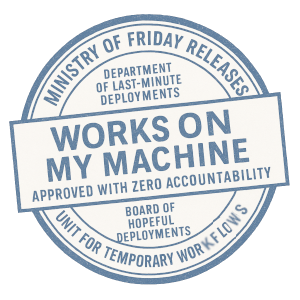

# 🎉 PyGrunn 2025 Demo Project — Simple Streaming in Python Ecosystem



This repo is your all-in-one playground for FastStream, Redis Streams, PostgreSQL, Superset, and more — fully containerized and ready to go.

> 🐍 Built with Python  
> ⚡ Fueled by Redis Streams  
> 🚀 Launched with Docker  
> 🎯 Built for fun, learning, and live coding!

---

## 🚀 Getting Started

1. Clone the repo:

   ```bash
   git clone git@github.com:ckopnio/pygrunn-demo.git
   cd pygrunn-demo
   ```

2. A `.env` file is already included — no extra setup needed.

3. Launch the stack:

   ```bash
   docker compose up --build
   ```

---

## 🧩 What’s in the Box?

### 🟥 Redis  
→ `localhost:6379`  
Your real-time event stream backbone.

### 🧠 Redis Commander  
→ [http://localhost:8081](http://localhost:8081)  
UI for exploring Redis data.

### 🐘 PostgreSQL  
→ `localhost:5432`  
Holds subscription data.  
Credentials:
- **User**: `postgres`
- **Password**: `postgres`
- **DB**: `subscriptions`

### 📊 pgAdmin  
→ [http://localhost:80](http://localhost:80)  
Database UI — no login needed!  
To connect to the database:
- **Password**: `postgres`

### 📈 Superset  
→ [http://localhost:8088](http://localhost:8088)  
Dashboard & data viz platform.  
Login:
- **Username**: `admin`
- **Password**: `admin`

---

## 🛠️ Microservices (FastStream)

All built in Python using FastStream:

- `subscription-service`: streams new subscription events
- `sink-service`: stores streamed data into PostgreSQL
- `statistic-service`: calculates and serves aggregated stats for dashboards

Each runs from a separate `app.py`.

---

## 🔧 Custom Ports?

Edit the `.env` file:

```env
REDIS_PORT=6379
REDIS_COMMANDER_PORT=8081
POSTGRES_PORT=5432
PGADMIN_PORT=80
SUPERSET_PORT=8088
```

Then restart:

```bash
docker compose down
docker compose up --build
```

---

## 🧹 Clean Up

Nuke all containers and volumes:

```bash
docker compose down -v
```

---

## 💬 Why This Exists

This demo was built for **PyGrunn 2025** to showcase modern Python stream processing — real-time ingestion, storage, and visualization — all with Docker and good vibes.

---
